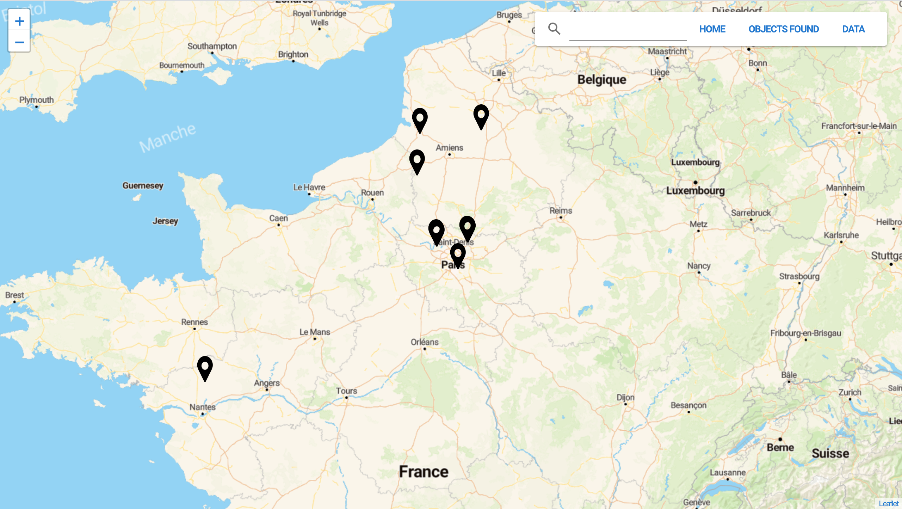
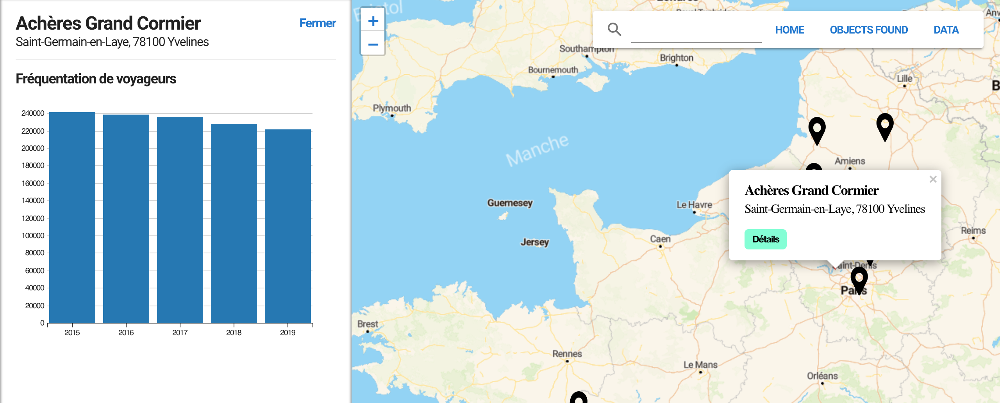
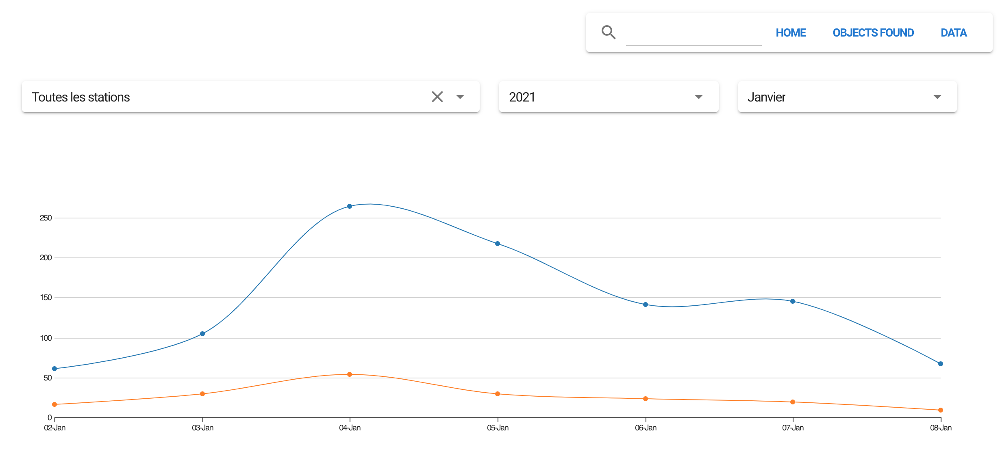

# 🏆 vue-dataviz

This is an application containing several data visualization interfaces in the form of a table, a map or even a graph. These datasets come from the SNCF API and through this application, the objective is to display them in a simple and useful way to travelers or any average user.

## 😘 Features

- Display all stations on a map



- Display details of passenger frequency over a number of years for each station



- Display statistics on found objects by station and sort by date



- Search by station to obtain certain information such as the regularity of different types of trains. The display is in the form of a table


## ✨ Application available on the web

You can see the application deployed with this [link](http://159.203.170.203).

## 👨‍💻 Environment Setup

- Installing NodeJS

Before you can run a VueJS app locally, you must install NodeJS. NodeJs is a JavaScript runtime environment that executes JS code without a browser. For more details, click [here](https://nodejs.org/en/).

- Npm

After installation, (re)start your terminal/CLI interface and type `npm -v`, if you want to know the npm version. [More](https://nodejs.org/en/knowledge/getting-started/npm/what-is-npm/).

- Installing `vue-cli`

Vue-cli is a command line helper for generating and managing VueJS applications.
Use the command : `npm install -g @vue/cli`

- Installing `d3js` and `leaflet`

`npm i vue-d3-charts` and `npm i vue2-leaflet`

- Get the project and launch server

In your terminal, 
```sh
git clone https://github.com/ObonePaule/vue-dataviz
cd vue-dataviz
npm run serve
```


### 🚀 Production mode

```sh
git clone https://github.com/ObonePaule/vue-dataviz
cd vue-dataviz
npm run build
```


### 📈  Visualization components

- Map

On the home page, we have a map which represents all the stations with a popup describing the name and address of it.

- Bar Chart

Still on the home page, the popup allows us to display the details of a station. These details are in the form of two bar charts: one for statistics on the number of passengers and another for canceled or late trains. Regarding the second diagram, it has been implemented but some errors remain with the uic-code.

- Line Chart

The online diagram allows you to visualize the statistics on the objects found, classified by station and by date. The user has the right to a parameter selector to refine his search.

- Table 

With menu, we have the option to search by station, but for this some other information that could help users. We enter the name of a station and we have the result in tabular form.


### 🎮 Technical Choices

- VueJS & VuetifyJS

Vue.js, is an open-source JavaScript framework used to build user interfaces and single-page web applications. The entire project was done in VueJs. 
Vuetify is a Vue UI Library with beautifully handcrafted Material Components. If you want to know more, go to the [VueJs](https://vuejs.org/v2/guide/) site and the [Vuetify](https://vuetifyjs.com/en/introduction/why-vuetify/).

- Axios

Axios is a JavaScript library that works as an HTTP client. It allows to communicate with APIs using requests. [More](https://fr.vuejs.org/v2/cookbook/using-axios-to-consume-apis.html)

- Leaflet

leaflet is an open-source JavaScript library for mobile-friendly interactive maps. For its using with VueJs, [click here](https://vue2-leaflet.netlify.app/). 

- D3js

D3js is a JavaScript library for manipulating documents based on data. D3 helps you bring data to life using HTML, SVG, and CSS. D3’s emphasis on web standards gives you the full capabilities of modern browsers without tying yourself to a proprietary framework, combining powerful visualization components and a data-driven approach to DOM manipulation. [More](https://d3js.org/)


### 🏄‍♂️ Authors

[Paule Samantha](https://github.com/ObonePaule)
